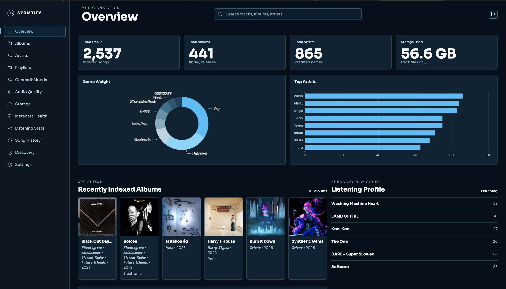
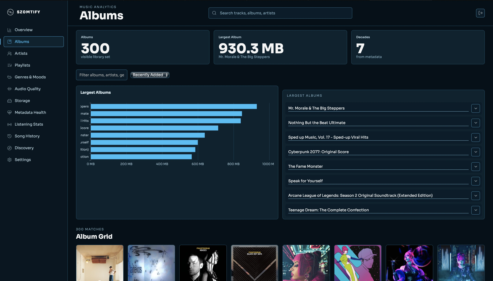
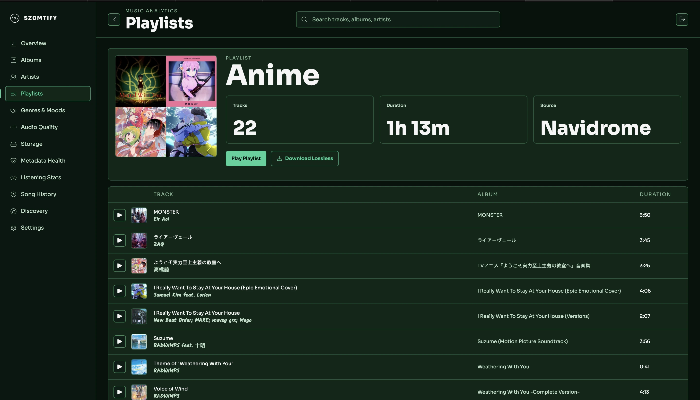
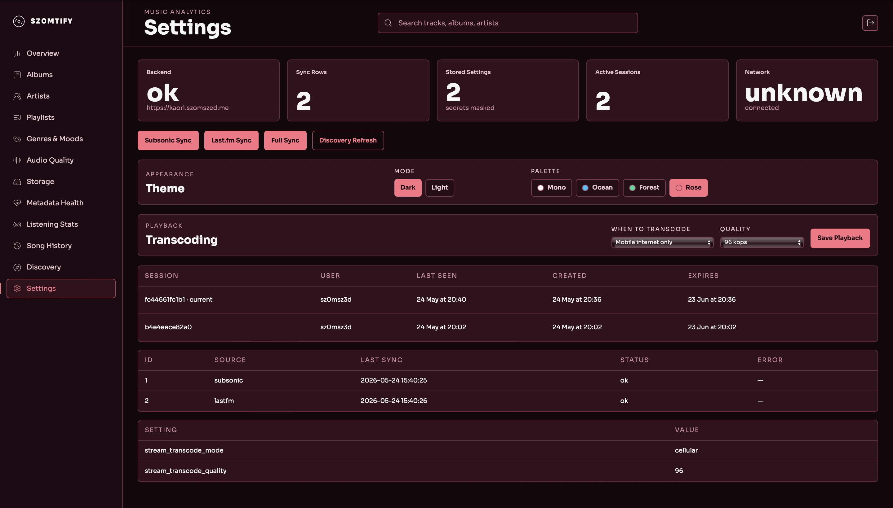
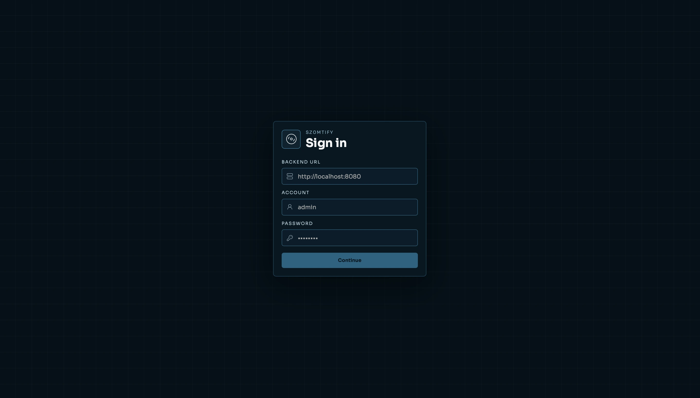
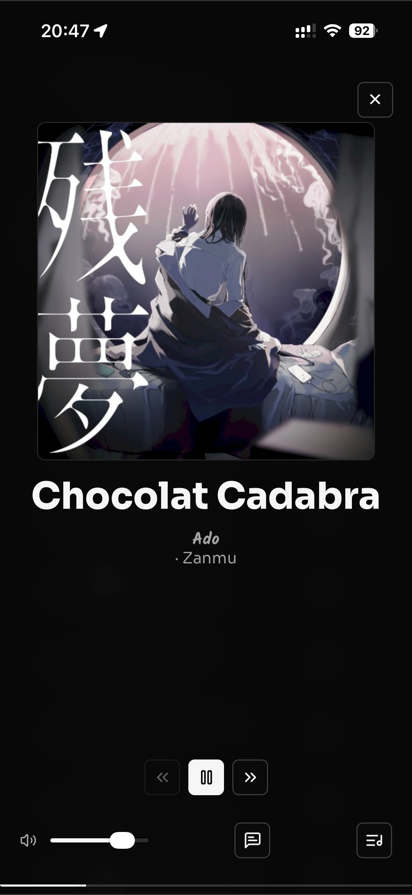
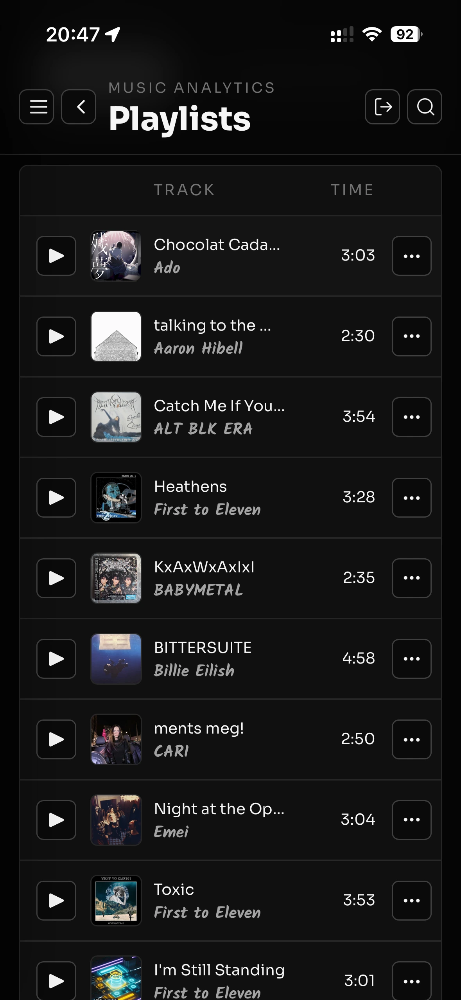
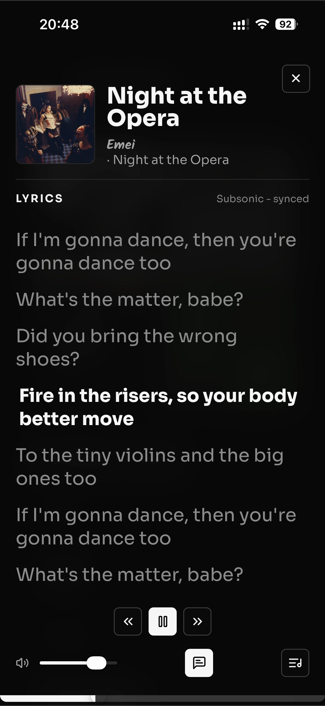

# sz0mtify

<p align="center">
  
</p>

<p align="center">
  
  
  
  
  
  
</p>

<p align="center">
  A self-hosted music analytics and listening companion for Subsonic/Navidrome libraries.
  sz0mtify turns your library into charts, discovery lists, storage insight, playlists,
  mobile playback, and a clean app-like interface.
</p>

## What It Does

sz0mtify is built for people who host their own music and still want the polished parts of a modern music app: fast browsing, rich stats, queue controls, offline-friendly mobile behavior, and a dashboard that makes your library feel alive.

It connects to your Subsonic-compatible server, keeps credentials server-side, and lets the frontend choose the backend URL safely at login.

## Gallery

### Desktop

| Overview | Albums |
| --- | --- |
|  |  |

| Playlist | Settings |
| --- | --- |
|  |  |

| Login |
| --- |
|  |

### Mobile App

| Player | Playlist | Lyrics |
| --- | --- | --- |
|  |  |  |

## Features

### Library Browsing

- Albums, artists, playlists, tracks, genres, and search.
- Detail pages with back navigation that remembers where you came from.
- Pagination for large libraries.
- Cover art proxying through the backend so media credentials stay private.

### Listening And Analytics

- Overview dashboard for library health and listening shape.
- Top artists, albums, tracks, current rotation, rediscovery candidates, and timeline charts.
- Genre, format, bitrate, extension, content type, and storage breakdowns.
- Metadata health and suspicious file views for cleanup.

### Player Experience

- Full player with queue, history, adjacent-track views, and mobile expansion.
- Playlist and album playback actions.
- Track actions for sharing, queueing, downloading, and local management.
- Lyrics-focused mobile view.
- Short-lived stream tokens for safer audio playback.

### Discovery

- Last.fm-powered discovery from artists already in your library.
- Missing albums, new release candidates, and similar artists.
- Cached discovery data so refreshes are practical and repeatable.

### Mobile And Native

- Responsive layout tuned for phone screens.
- iOS Capacitor wrapper.
- Swipe gestures for navigation and mobile menu behavior.
- Local media support for downloaded albums, playlists, and tracks.
- Mobile-safe image behavior that avoids messy long-press browser menus.

### Settings And Personalization

- Light and dark mode.
- Multiple color palettes.
- Backend URL entry on login with `/api/health` validation.
- Subsonic/Navidrome and Last.fm settings.
- Sync controls and sync statistics.

## Quick Start

1. Copy the example environment file.

   ```bash
   cp .env.example .env
   ```

2. Add an app password in `.env`.

   ```bash
   APP_PASSWORD=change-me
   ```

3. Start the app.

   ```bash
   docker compose up --build
   ```

4. Open the frontend.

   ```text
   http://localhost:5173
   ```

On the login screen, enter your backend URL, usually:

```text
http://localhost:8080
```

The app checks the backend health endpoint before saving the URL.

## Native Linux Package

Arch Linux:

```bash
makepkg -si
```

This builds the Tauri desktop app and installs the `sz0mtify` command, desktop entry, and icons.

Debian and RPM packages can be built from the frontend directory:

```bash
cd frontend
npm run tauri build
```

## Configuration

The app can be started with very little configuration. These are the values most people care about:

| Variable | Purpose |
| --- | --- |
| `APP_PASSWORD` | Password for the sz0mtify login. |
| `SUBSONIC_BASE_URL` | Your Navidrome/Subsonic server URL. |
| `SUBSONIC_USERNAME` | Music server username. |
| `SUBSONIC_PASSWORD` | Music server password. |
| `LASTFM_API_KEY` | Enables discovery and Last.fm enrichment. |
| `FRONTEND_BASE_URL` | Public frontend URL when deploying. |
| `CAPACITOR` | Keeps iOS app origins allowed. Defaults to `true`. |

Subsonic and Last.fm values can also be entered from the settings screen.

## Local Development

Frontend:

```bash
cd frontend
npm install
npm run dev
```

Backend:

```bash
cd backend
cargo run
```

Quality checks:

```bash
cd frontend && npm run check
cd backend && cargo test
```

## iOS

The iOS app is a Capacitor wrapper around the static frontend.

```bash
cd frontend
npm run build:mobile
npm run cap:open:ios # requires macos for calling xcode
```

## Stack

| Layer | Tools |
| --- | --- |
| Frontend | SvelteKit, TypeScript, SCSS, ECharts |
| Backend | Rust, Axum, SQLx |
| Data | SQLite |
| Music source | Subsonic/Navidrome-compatible APIs |
| Discovery | Last.fm |
| Mobile | Capacitor iOS |
| Deployment | Docker Compose |

## Status

sz0mtify is a self-hosted personal music app. It favors practical features, private credentials, local ownership, and a native-feeling mobile experience over a public multi-user service.
